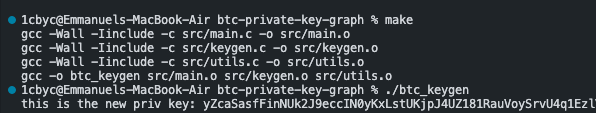

# btc-private-key-graph

three years ago, i wrote a c# program to allow me generate bitcoin private key especially when they are incomplete. since there has been alot of change with these things, i am inclined to write it more efficiently.

# just do this
1. run the `make` command
2. then run the generated executable like: ./btc

